# BarkBuddy 🐾
**Sistema de localização e apoio para pets** – um app que ajuda tutores a manterem seus animais seguros, com recursos de localização, alerta de perdido, perfil do pet, contatos de confiança e integração com hardware IoT/NFC.

> “Porque seu melhor amigo nunca deve ficar perdido.”

---

## 📌 Sumário
- [Visão geral](#-visão-geral)
- [Funcionalidades](#-funcionalidades)
- [Arquitetura & Tecnologias](#-arquitetura--tecnologias)
- [Screenshots](#-screenshots)
- [Como rodar o projeto (dev)](#-como-rodar-o-projeto-dev)
- [Configuração do Firebase](#-configuração-do-firebase)
- [Mapas, NFC e QR](#-mapas-nfc-e-qr)
- [Modelos de dados (exemplo)](#-modelos-de-dados-exemplo)
- [Regras básicas do Firestore (exemplo)](#-regras-básicas-do-firestore-exemplo)
- [Protótipo IoT (opcional)](#-protótipo-iot-opcional)
- [Estrutura de pastas (sugerida)](#-estrutura-de-pastas-sugerida)
- [Scripts úteis](#-scripts-úteis)
- [Roadmap](#-roadmap)
- [Contribuição](#-contribuição)
- [Equipe](#-equipe)
- [Licença](#-licença)

---

## 🎯 Visão geral
O BarkBuddy integra **app móvel** (Expo/React Native + TypeScript + Firebase) e, opcionalmente, um **rastreador físico** (ESP32 + GPS + SIM800L) e **identificação por NFC/QR**. A ideia é oferecer localização e apoio mesmo quando o GPS falha, usando alternativas como **NFC/QR para contato imediato e envio da localização** por quem encontrou o pet.

---

## 🧩 Funcionalidades
- **Localização** do pet (GPS / aproximação por celular)
- **Alerta de pet perdido** com avisos à rede de confiança
- **NFC/QR de emergência**: quem encontrar o pet acessa o perfil e pode enviar a posição
- **Perfil completo do pet** (dados médicos, comportamentais, foto)
- **Rede colaborativa** (amigos/vizinhos) para ampliar o alcance do alerta
- **Notificações push** para eventos críticos (perdido/encontrado/atualizações)

---

## 🏗️ Arquitetura & Tecnologias

### 📱 Aplicativo (Mobile)
- **Expo + React Native + TypeScript**
- Navegação com **[Expo Router](https://expo.dev/router)**
- Integração com **Firebase**:
  - 🔐 Authentication  
  - ☁️ Firestore  
  - 🗂️ Storage  
  - 🔔 FCM (Push Notifications)

### 🗺️ Mapas
- **OpenStreetMap** (API)
- **Mapa Iphone Nativo** (IOS)
- **Leaflet.js** (Android)

### 🔍 Identificação
- Leitura de **QR Code** como método alternativo de autenticação ou acesso

### 🖼️ Manipulação de Imagens (Java)
- Conversão de imagem → bits  
- Conversão de bits → imagem  
- Armazenamento eficiente no **Firebase Storage**  
*(realizado com Java como serviço auxiliar)*

### 📡 IoT
- **ESP32** + **GPS NEO-6M** + **SIM800L**
  - Localização via GPS
  - Comunicação via rede móvel (GSM)

---

## Telas do Aplicativo

<details>
  <summary>Telas do App (clique para expandir)</summary>

  ### Tela de Login
  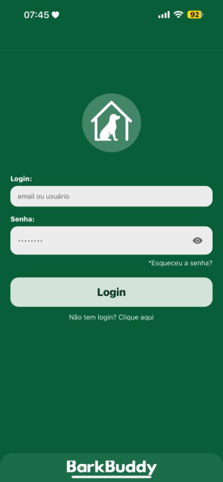

  ### Perfil do Pet
  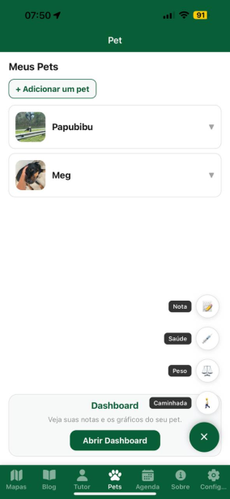

  ### Tela de Localização
  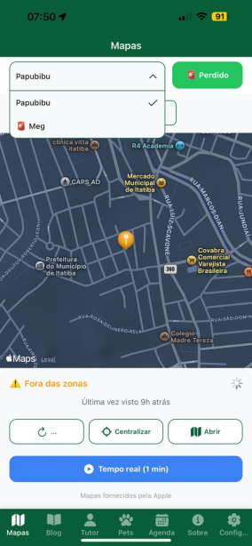

  ### Agenda
  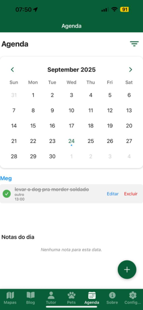

  ### Agendar
  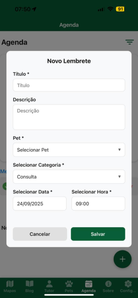

  ### Blog
  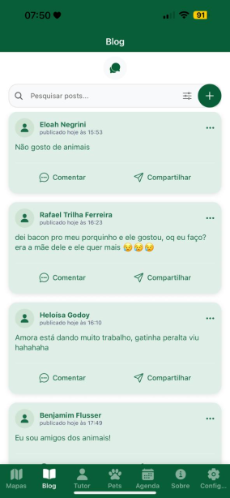

  ### Inicio
  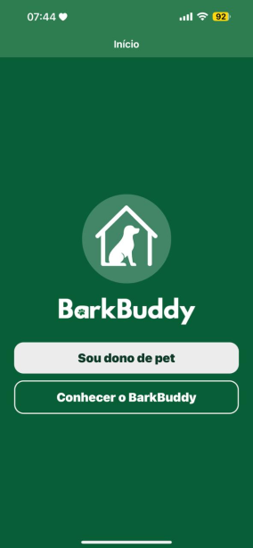

  ### Perfil
  

  ### Postar
  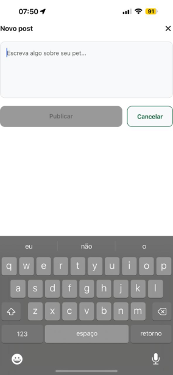

  ### Sobre
  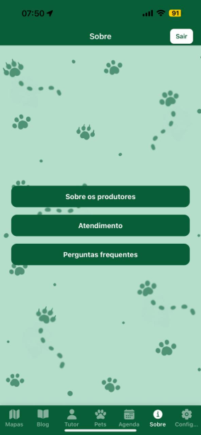

</details>

<details>
  <summary>Telas Web (clique para expandir)</summary>

  ### Adquirir
  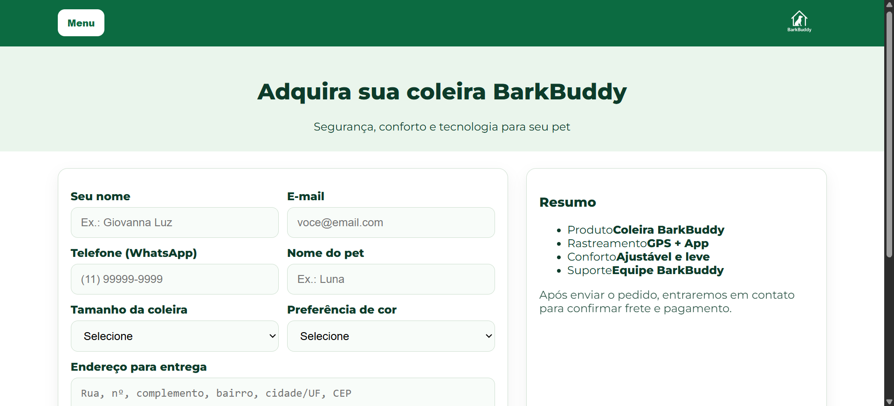

  ### Contato
  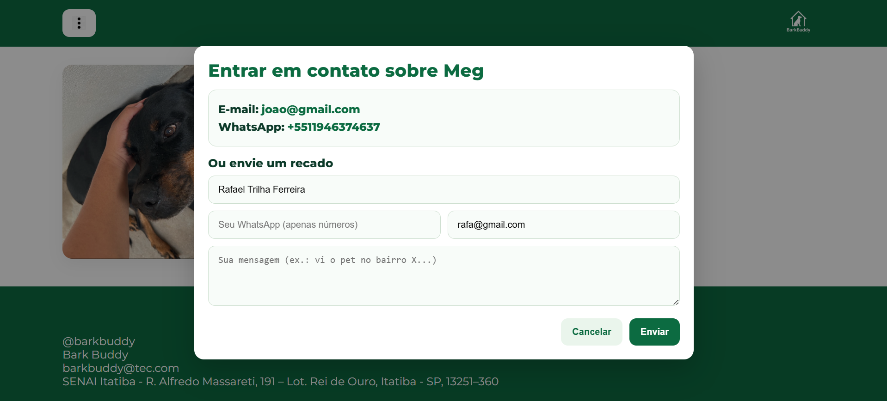

  ### Inicio Web
  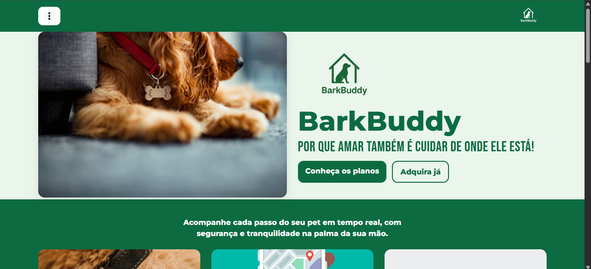

  ### Logado
  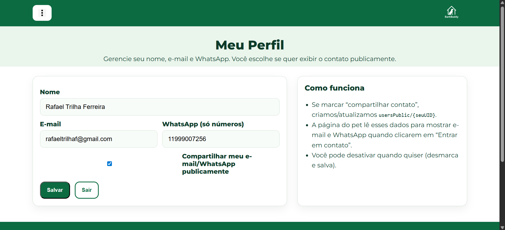

  ### Perdidos
  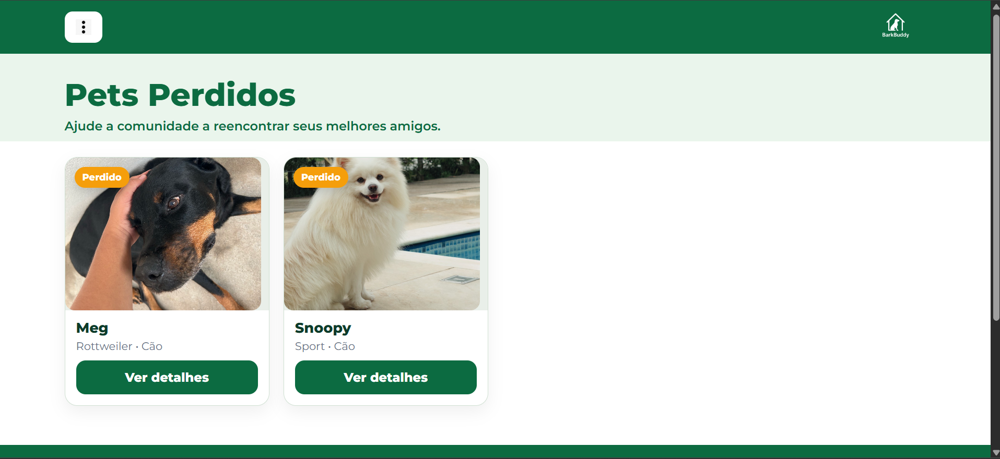

  ### Perfil Web
  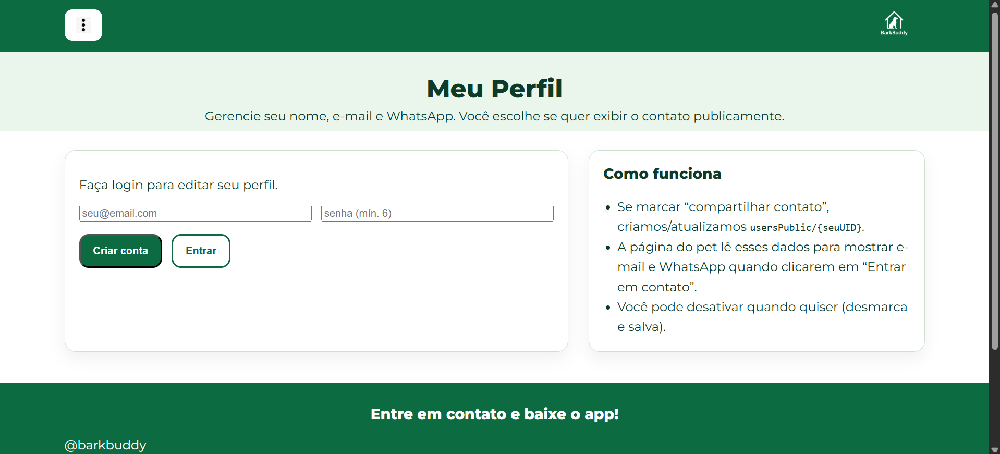

  ### Planos
  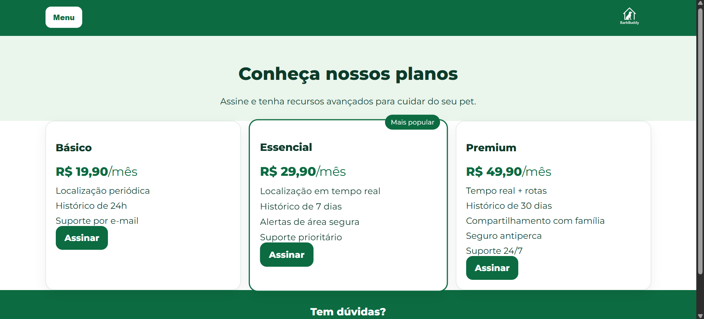

</details>


---

## ▶️ Como rodar o projeto (dev)

### Requisitos
- Node LTS (>= 18) e npm/yarn/pnpm  
- **Expo CLI** (`npm i -g expo-cli`)  
- Android Studio (emulador) ou dispositivo físico (Expo Go)
- Uma conta **Firebase** configurada (veja abaixo)

### Passos
```bash
# 1) Clonar
git clone https://github.com/rafatrilhaf/BarkBuddy.git
cd BarkBuddy

# 2) Instalar dependências
npm install
# ou: yarn / pnpm i

# 3) Variáveis de ambiente (ver seção "Configuração do Firebase")
#    Crie um arquivo .env com as chaves EXPO_PUBLIC_*

# 4) Rodar
npx expo start

# 5) Abrir no Android ou iOS
#    pressione a para Android, i para iOS (Mac), w para Web (alguns módulos nativos não funcionam no Web)
